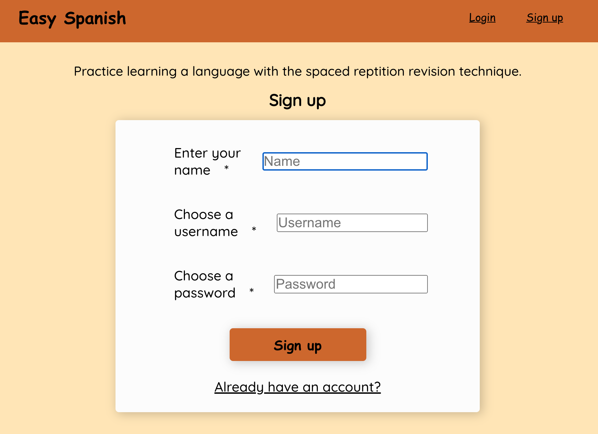
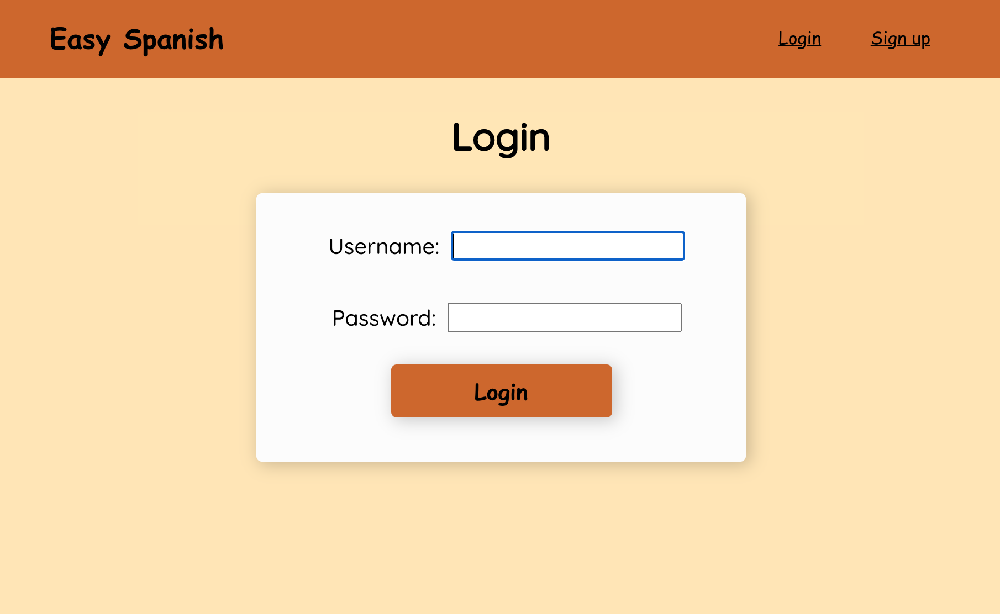
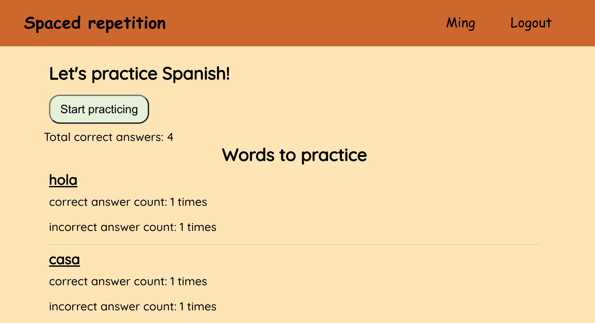
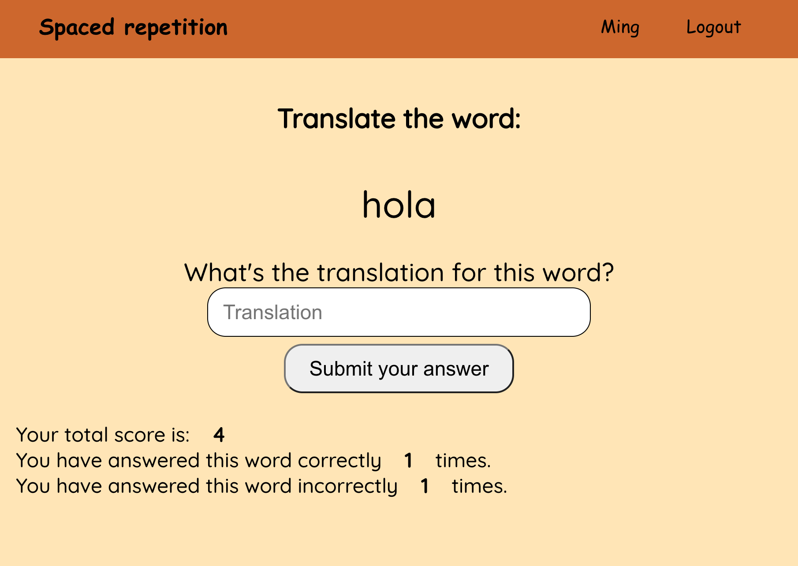

# Spaced Repetition

## Links

- Live Deployment: https://spaced-repetition-client-jet.vercel.app/
- Server Repository: https://github.com/cmgrace/spaced-repetition-api
- Client Repository: https://github.com/cmgrace/spaced-repetition-client

## Summary

This application is a language learning application using the Spaced Repetition learning technique!

## User Stories

#### Landing Page

- Users start off on a landing page, where they are provided with the options to login or register

#### Dashboard

- After login - users are directed to their dashboard which displays the language to learn, and a list of words for practice.
- Users can see their total score
- Users can see their incorrect count and correct count for each word

#### Learn Page

- Users are shown one word at a time, and provided a prompt to submit their answer for the translation
- Users can see their total score
- Users can see the number of times they have answered the current word correctly and incorrectly

#### Feedback Page

- After posting a guess, users are directed to a feedback page

###### On the feedback page users can see

- The word they were asked to translate
- The correct translation
- Their guess
- Feedback regarding if their guess was correct or incorrect
- New total score
- New correct answer count for that word
- New incorrect answer count for that word

## Technology Used

### Client:

- ReactJS
- react-router-dom for routing and in-app navigation
- CSS (vanilla CSS)
- Babel
- Webpack
- Vercel for deployment
- Cypress for testing

### Backend:

- Express for handling API requests
- NodeJS for interacting with the file system
- Postgrator for database migration
- Mocha, Chai, Supertest for endpoints testing
- Knex.js for interfacing with PostgreSQL database
- Heroku for database and server deployment
