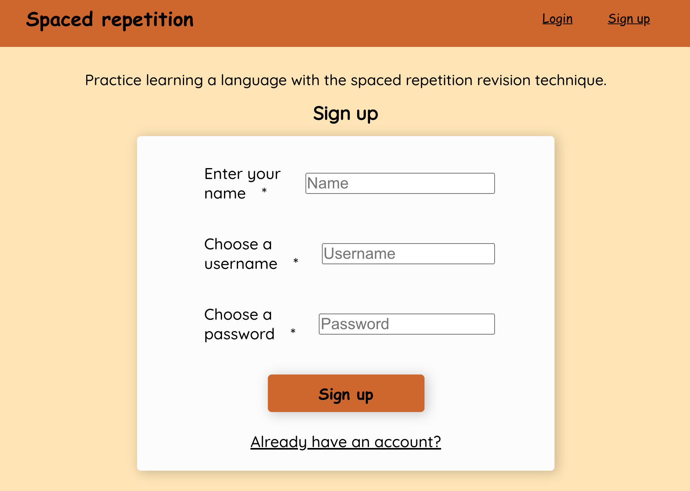
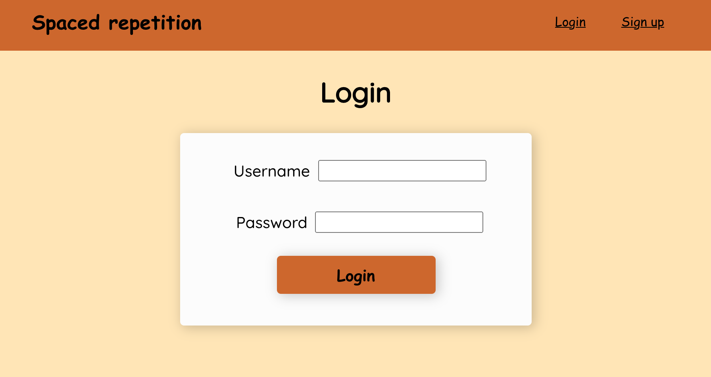

# Spaced Repetition

## Links

- Live Deployment: https://spaced-repetition-client-jet.vercel.app/
- Server Repository: https://github.com/cmgrace/spaced-repetition-api

## Summary

This application is a language learning application using the Spaced Repetition learning technique!

## Main feature

#### Landing Page

- The landing page provides users with login and register feature

#### Dashboard

- After login - users are directed to their dashboard which displays the language to learn, and a list of words for practice.
- Users can see their total score
- Users can see their incorrect count and correct count for each word

#### Learn Page

- Users are shown one word at a time, and provided a prompt to submit their answer for the translation
- Users can see their total score
- Users can see the number of times they have answered the current word correctly and incorrectly

#### Feedback Page

- After posting a guess, users are directed to a feedback page

###### On the feedback page users can see

- The word they were asked to translate
- The correct translation
- Their guess
- Feedback regarding if their guess was correct or incorrect
- New total score
- New correct answer count for that word
- New incorrect answer count for that word

## Technology Used

### Frontend

- ReactJS
- React Router
- React Context
- HTML
- CSS
- Webpack
- Cypress for testing
- Deployed at Vercel

### Backend

- RESTful API
- Node & Express
- PostgresSQL
- Knex
- Supertest
- Mocha & Chai
- Deployed Heroku
